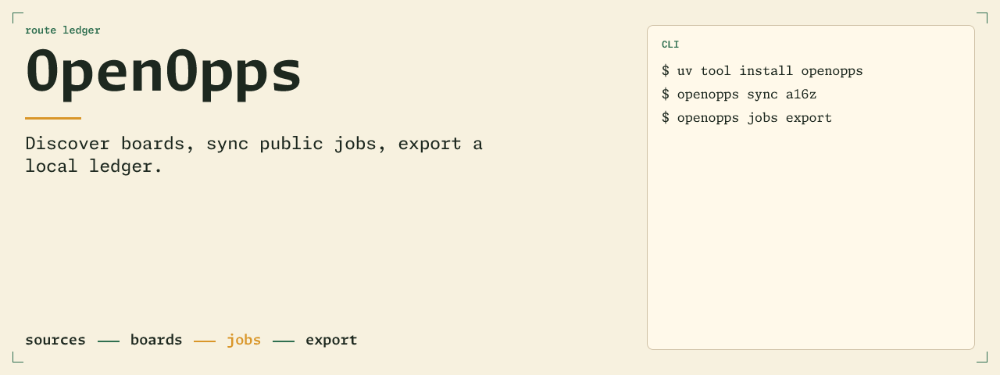
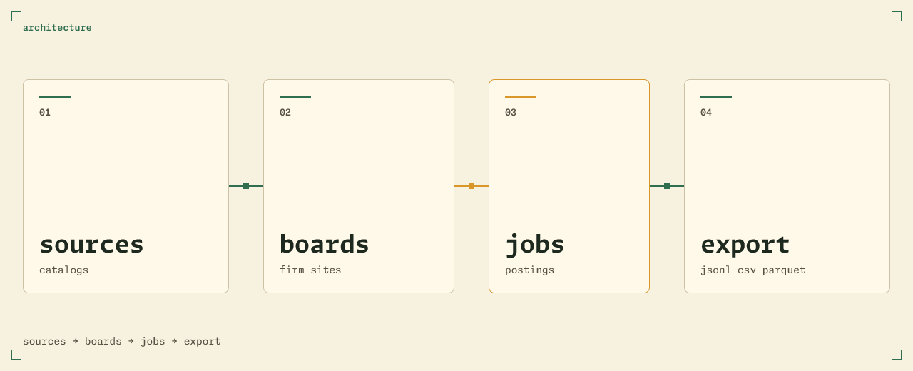
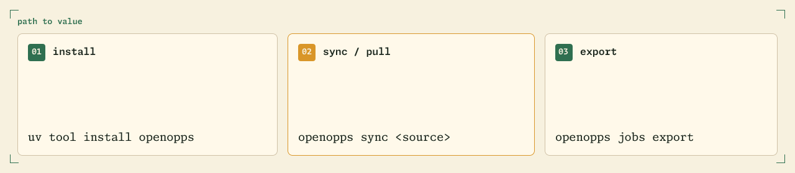
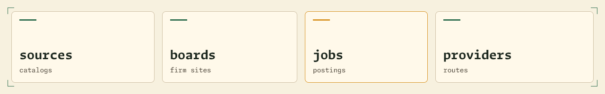
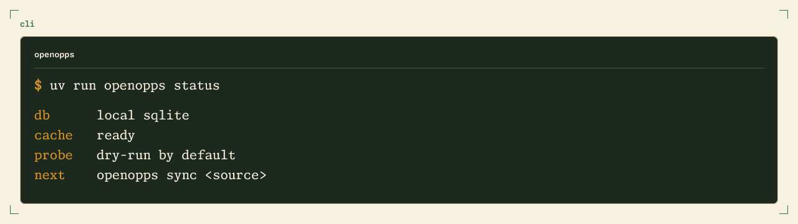
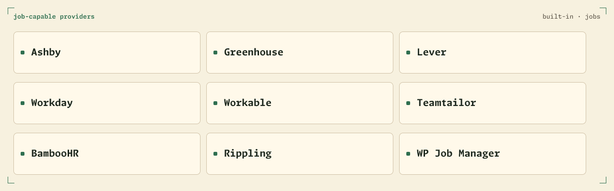

<p align="center">
  <picture>
    <source media="(prefers-color-scheme: dark)" srcset="assets/readme/hero-dark.png">
    
  </picture>
</p>

# OpenOpps

<div align="center">

<!-- BADGES:START -->
<!-- shieldcn.dev · variant=outline theme=green font=geist-mono size=sm -->
<p align="center">
  <a href="https://github.com/wyattowalsh/openopps/actions/workflows/ci.yml"><picture><source media="(prefers-color-scheme: dark)" srcset="https://shieldcn.dev/github/ci/wyattowalsh/openopps.svg?variant=outline&amp;theme=green&amp;font=geist-mono&amp;size=sm&amp;mode=dark"></picture></a>
  <a href="https://pypi.org/project/openopps/"><picture><source media="(prefers-color-scheme: dark)" srcset="https://shieldcn.dev/pypi/openopps.svg?variant=outline&amp;theme=green&amp;font=geist-mono&amp;size=sm&amp;logo=pypi&amp;mode=dark"></picture></a>
  <a href="https://github.com/wyattowalsh/openopps/blob/main/LICENSE"><picture><source media="(prefers-color-scheme: dark)" srcset="https://shieldcn.dev/github/license/wyattowalsh/openopps.svg?variant=outline&amp;theme=green&amp;font=geist-mono&amp;size=sm&amp;mode=dark"></picture></a>
  <a href="https://www.python.org/"><picture><source media="(prefers-color-scheme: dark)" srcset="https://shieldcn.dev/pypi/python/openopps.svg?variant=outline&amp;theme=green&amp;font=geist-mono&amp;size=sm&amp;logo=python&amp;mode=dark"></picture></a>
  <a href="https://github.com/wyattowalsh/openopps/commits"><picture><source media="(prefers-color-scheme: dark)" srcset="https://shieldcn.dev/github/last-commit/wyattowalsh/openopps.svg?variant=outline&amp;theme=green&amp;font=geist-mono&amp;size=sm&amp;mode=dark"></picture></a>
</p>
<p align="center">
  <a href="https://github.com/wyattowalsh/openopps/stargazers"><picture><source media="(prefers-color-scheme: dark)" srcset="https://shieldcn.dev/github/stars/wyattowalsh/openopps.svg?variant=outline&amp;theme=green&amp;font=geist-mono&amp;size=sm&amp;mode=dark"></picture></a>
  <a href="https://github.com/wyattowalsh/openopps/issues"><picture><source media="(prefers-color-scheme: dark)" srcset="https://shieldcn.dev/github/open-issues/wyattowalsh/openopps.svg?variant=outline&amp;theme=green&amp;font=geist-mono&amp;size=sm&amp;mode=dark"></picture></a>
  <a href="https://openopps.dev/docs"><picture><source media="(prefers-color-scheme: dark)" srcset="https://shieldcn.dev/badge/docs-openopps.dev-green.svg?variant=outline&amp;theme=green&amp;font=geist-mono&amp;size=sm&amp;mode=dark"></picture></a>
  <a href="https://www.kaggle.com/datasets/wyattowalsh/openoppsdb"><picture><source media="(prefers-color-scheme: dark)" srcset="https://shieldcn.dev/badge/data-Kaggle-green.svg?variant=outline&amp;theme=green&amp;font=geist-mono&amp;size=sm&amp;logo=kaggle&amp;mode=dark"></picture></a>
</p>
<p align="center">
  <a href="https://openopps.dev/docs/cli"><picture><source media="(prefers-color-scheme: dark)" srcset="https://shieldcn.dev/badge/CLI-Typer-green.svg?variant=branded&amp;theme=green&amp;font=geist-mono&amp;size=sm&amp;logo=gnubash&amp;label=CLI&amp;mode=dark"></picture></a>
  <a href="https://docs.astral.sh/uv/"><picture><source media="(prefers-color-scheme: dark)" srcset="https://shieldcn.dev/badge/uv-Astral-green.svg?variant=branded&amp;theme=green&amp;font=geist-mono&amp;size=sm&amp;logo=uv&amp;label=uv&amp;mode=dark"></picture></a>
  <a href="https://typer.tiangolo.com/"><picture><source media="(prefers-color-scheme: dark)" srcset="https://shieldcn.dev/badge/Typer-CLI-green.svg?variant=branded&amp;theme=green&amp;font=geist-mono&amp;size=sm&amp;logo=fastapi&amp;label=Typer&amp;mode=dark"></picture></a>
  <a href="https://www.python.org/"><picture><source media="(prefers-color-scheme: dark)" srcset="https://shieldcn.dev/badge/Python-3.12%2B-green.svg?variant=branded&amp;theme=green&amp;font=geist-mono&amp;size=sm&amp;logo=python&amp;label=Python&amp;mode=dark"></picture></a>
  <a href="https://github.com/wyattowalsh/openopps/blob/main/DESIGN.md"><picture><source media="(prefers-color-scheme: dark)" srcset="https://shieldcn.dev/badge/Route_Ledger-DESIGN.md-green.svg?variant=branded&amp;theme=green&amp;font=geist-mono&amp;size=sm&amp;logo=lu:BookMarked&amp;label=Route%20Ledger&amp;mode=dark"></picture></a>
</p>
<!-- BADGES:END -->

</div>

<p align="center">
  <picture>
    <source media="(prefers-color-scheme: dark)" srcset="assets/readme/architecture-dark.png">
    
  </picture>
</p>

<p align="center">
  <picture>
    <source media="(prefers-color-scheme: dark)" srcset="assets/readme/path-to-value-dark.png">
    
  </picture>
</p>

<p align="center">
  <picture>
    <source media="(prefers-color-scheme: dark)" srcset="assets/readme/nouns-dark.png">
    
  </picture>
</p>

<p align="center">
  <picture>
    <source media="(prefers-color-scheme: dark)" srcset="assets/readme/cli-terminal-dark.png">
    
  </picture>
</p>

<p align="center">
  <picture>
    <source media="(prefers-color-scheme: dark)" srcset="assets/readme/providers-dark.png">
    
  </picture>
</p>

| Docs | |
| --- | --- |
| [CLI](https://openopps.dev/docs/cli) | Commands and workflow |
| [Providers](https://openopps.dev/docs/providers) | Adapters and coverage |
| [Operations](https://openopps.dev/docs/operations) | Local runbook |
| [Public data](https://openopps.dev/docs/public-data-releases) | Release gates |
| [Contributing](https://openopps.dev/docs/contributing) | Checkout workflow |
| [Configuration](https://openopps.dev/docs/configuration) | `OPENOPPS_` settings |
| [Agent plugins](https://openopps.dev/docs/agent-plugins) | Skills and MCP |
| [Data model](https://openopps.dev/docs/data-model) | Schema |

[OpenOppsDB](https://www.kaggle.com/datasets/wyattowalsh/openoppsdb) · [Starter](https://www.kaggle.com/code/wyattowalsh/openoppsdb-starter-notebook) · [Explorer](https://www.kaggle.com/code/wyattowalsh/openoppsdb-explorer) · [Advanced](https://www.kaggle.com/code/wyattowalsh/openoppsdb-advanced-usage) · [SQL](https://www.kaggle.com/code/wyattowalsh/openoppsdb-sql-playground) · [Market map](https://www.kaggle.com/code/wyattowalsh/openoppsdb-hiring-market-map) · [Skills](https://www.kaggle.com/code/wyattowalsh/openoppsdb-skills-radar) · [Snapshot](https://www.kaggle.com/code/wyattowalsh/openoppsdb-snapshot-health)

Source policy is fail-closed: `just source-policy-check` is the structural CI gate and `just source-policy-audit` is the release-eligibility gate, where 0 are independently verified and 1780 are blocked.

## Install

```bash
uv tool install openopps
openopps --help
openopps --install-completion
openopps status
openopps doctor
```

```bash
uv sync
uv run openopps admin db init
uv run openopps https://jobs.ashbyhq.com/example
# or: uv run openopps sync a16z --metrics-json
uv run openopps status
```

`OPENOPPS_DB_URL` defaults to `sqlite:///openoppsdb.sqlite`. See [configuration](https://openopps.dev/docs/configuration).

## CLI

```bash
uv run openopps --help
uv run openopps sources list
uv run openopps sync a16z --metrics-json
uv run openopps boards list --source a16z --limit 10
uv run openopps jobs list --json
uv run openopps jobs export --format parquet --output /tmp/openopps-jobs.parquet
uv run openopps discovery scout --output /absolute/quarantine-root --json
```

| Group | Job |
| --- | --- |
| `status` / `doctor` | Everyday local inspection; doctor is URL-first, never discovery |
| `sync` | sources → boards → jobs |
| `sources` / `boards` / `jobs` | inspect, sync, export |
| `providers` | coverage, audit, health |
| `discovery` | quarantined scout; not same-run with `sync` |

[CLI docs](https://openopps.dev/docs/cli)

## Providers

```bash
uv run openopps providers coverage --json
uv run openopps providers audit --source a16z --json
uv run openopps providers health --source a16z --provider any --limit 25 --json
```

| Adapter | Support |
| --- | --- |
| `ashbyhq`, `greenhouse`, `lever`, `workday`, `workable`, `teamtailor`, `bamboohr`, `rippling`, `wpjobmanager` | jobs |
| `manatal`, `gem` | detect |

[Providers docs](https://openopps.dev/docs/providers)

## Validation

```bash
just ci
uv run pytest
uv lock --check
rtk npx -y @fission-ai/openspec@1.6.0 validate --all --strict
```

[Contributing](https://openopps.dev/docs/contributing) · [Operations](https://openopps.dev/docs/operations)

---

[MIT License](https://github.com/wyattowalsh/openopps/blob/main/LICENSE) · [Docs](https://openopps.dev/docs) · [Contributing](CONTRIBUTING.md)
