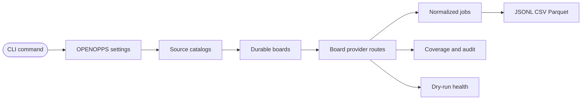

OpenOpps exposes the `openopps` console script from `openopps.cli:app`. Use the reference as a command map: every surface is local-first, every write lands in SQLite, and every live provider check is explicit.

## Invocation

Run through the repository environment during development:

```bash
uv sync
just --list
uv run openopps --help
uv run openopps status
```

Install the current checkout as an editable uv tool when you want to call `openopps` directly:

```bash
uv tool install -e .
openopps --help
openopps status
```

The editable tool uses the same runtime settings as `uv run`, including `OPENOPPS_DB_URL`, plugin allow lists, cache settings, and current working-directory-relative SQLite paths.

## Mental Model

OpenOpps is a local pipeline, not a hosted service:



The usual sequence is:

1. Run `sync` for the full source, board, and job workflow.
2. Use `sources sync`, `boards sync`, or `jobs sync` when you want to rerun one stage.
3. Inspect `providers coverage` or `admin providers registry` when route metadata is still missing.
4. Use `jobs list`, `boards export`, or `jobs export` for analysis.

Use `status` or `doctor` between steps to see counts, route readiness, cache state, plugin load state, and the next recommended action.

## Help Discovery

OpenOpps help is part of the public CLI contract. It is organized around the normal workflow first, then operational surfaces, then advanced admin diagnostics:

```bash
uv run openopps --help
uv run openopps sync --help
uv run openopps providers --help
uv run openopps admin providers probe-routes --help
just cli-help
```

Use `--no-intro` when capturing root help in automation. Prefer semantic assertions in tests when help text changes: command groups, stable examples, JSON/metrics guidance, and key safety words should be covered without snapshotting terminal wrapping.

## Command Safety Classes

| Class                             | Examples                                                                                         | What changes                                                                               |
| --------------------------------- | ------------------------------------------------------------------------------------------------ | ------------------------------------------------------------------------------------------ |
| Read-only local inspection        | `status`, `doctor`, `sources list`, `providers coverage`, `plugins list`, `cache status`         | Reads local SQLite/catalog state only.                                                     |
| Writes local SQLite state         | `examples seed`, `sources sync`, `boards sync`, `jobs sync`, `admin boards add`, `admin db init` | Creates or updates records under `OPENOPPS_DB_URL` and cache settings.                     |
| Live upstream/network diagnostics | `admin sources test`, `providers health`, `admin providers probe-routes`                         | Calls public source or provider endpoints; dry-run unless the command documents `--apply`. |
| Destructive local maintenance     | `admin cache purge`                                                                              | Deletes local cache records; scope with `--namespace` when possible.                       |

## Global Options

| Option                   | Purpose                                                                                                                |
| ------------------------ | ---------------------------------------------------------------------------------------------------------------------- |
| `--intro` / `--no-intro` | Toggle the interactive startup portal animation for that command invocation.                                           |
| `OPENOPPS_NO_INTRO=1`    | Suppresses the animation across invocations, in addition to CI, completion, dumb-terminal, and non-interactive guards. |

## Command Groups

| Surface     | Commands                                        | Purpose                                                                    |
| ----------- | ----------------------------------------------- | -------------------------------------------------------------------------- |
| `sync`      | top-level                                       | Run source discovery, board route resolution, and job sync in order.       |
| `status`    | top-level                                       | Report database, cache, plugin, route readiness, and next action.          |
| `doctor`    | top-level                                       | Same status payload with setup-oriented framing.                           |
| `sources`   | `list`, `show`, `sync`                          | Inspect aggregate discovery catalogs and import board records.             |
| `boards`    | `sync`, `list`, `show`, `export`                | Resolve, inspect, and export firm or company hiring board records.         |
| `jobs`      | `sync`, `list`, `show`, `history`, `export`     | Fetch, inspect, version, and export normalized public postings.            |
| `providers` | `health`, `coverage`, `audit`                   | Inspect live health, persisted coverage gaps, and adoption evidence.       |
| `cache`     | `status`                                        | Inspect the SQLite request cache.                                          |
| `plugins`   | `list`                                          | Inspect installed plugin entry points, capabilities, and failures.         |
| `examples`  | `seed`                                          | Seed deterministic synthetic demo data.                                    |
| `admin`     | `sources`, `boards`, `providers`, `cache`, `db` | Advanced registration, route diagnostics, cache purge, and DB maintenance. |

## Option Conventions

Examples use long flags for readability. The CLI also exposes script-friendly short aliases for high-traffic options:

| Long flag         | Aliases    | Used by                                             |
| ----------------- | ---------- | --------------------------------------------------- |
| `--source`        | `-s`, `-S` | Source, board, job, provider, and audit scopes.     |
| `--board`         | `-b`, `-B` | Job sync/list/export and route diagnostics.         |
| `--provider`      | `-p`, `-P` | Board, job, provider, and route scopes.             |
| `--limit`         | `-n`, `-N` | List and diagnostic result limits.                  |
| `--json`          | `-j`, `-J` | Machine-readable command output.                    |
| `--output`        | `-o`, `-O` | JSONL/CSV/Parquet or no-DB output paths.            |
| `--format`        | `-f`, `-F` | Export format selection.                            |
| `--metrics-json`  | `-m`, `-M` | Sync metrics output.                                |
| `--refresh-cache` | `-r`, `-R` | Fresh upstream reads for cacheable request paths.   |
| `--verbose`       | `-v`, `-V` | Detailed sync warnings instead of compact progress. |

`--provider any` and `--provider all` both remove the provider filter. They are useful in reusable scripts that always pass a provider argument, but they do not mean “only providers named any/all.”

`--apply` is intentionally absent from most everyday commands. When it appears on diagnostics such as route probing or health checks, treat it as the boundary between inspection and persistence.

## Status Commands

```bash
uv run openopps status
uv run openopps status --json
uv run openopps doctor --json
```

JSON status output includes database counts, cache totals, plugin load status, route readiness, coverage gaps, issue codes, and `nextAction`.

Use this first when a command returns no data. It shows whether the local database is empty, whether route metadata is missing, and which next command should populate the missing layer.

## Full Sync Command

```bash
uv run openopps sync a16z --metrics-json --refresh-cache
uv run openopps sync --provider any --profile
```

`sync` runs `sources sync`, `boards sync`, then `jobs sync` with the same source, board, provider, cache, metrics, and verbosity conventions as the individual stages. Human output uses compact stage-aware progress; `--metrics-json` prints one combined metrics payload without progress text on stdout.

## Source Commands

```bash
uv run openopps sources list --json
uv run openopps sources show a16z
uv run openopps admin sources test a16z --page-size 5 --refresh-cache
uv run openopps admin sources yield --source a16z --json
uv run openopps sources sync a16z --metrics-json --refresh-cache
uv run openopps sources sync --profile
```

`sources list` reads configured local sources when present and falls back to the packaged source catalog when the database is empty.

`admin sources test` samples one adapter without writing board records to storage. Use it to confirm that an upstream source still returns parseable data before running a full sync.

`admin sources yield` reports offline source-yield metrics from persisted SQLite records. Use it after syncs to compare source families by company candidates, canonical boards, provider hints, job-capable routes, active job routes, duplicate board rate, and yield score. It never fetches sources or probes routes.

`sources sync` writes discovered sources, boards, and board-provider hints to SQLite by default. Add `--refresh-cache` when you need fresh upstream reads. Add `--verbose` when compact progress hides a useful adapter warning.

For one-off source extraction without database writes, pair `--no-db` with explicit JSONL output:

```bash
uv run openopps sources sync a16z --no-db --output /tmp/a16z-boards.jsonl
```

## Board Commands

```bash
uv run openopps boards list --source a16z --limit 10 --json
uv run openopps boards list --provider ashbyhq --market AI --has-jobs --json
uv run openopps boards sync --source a16z --provider any --limit 25 --metrics-json
uv run openopps boards show example-board
uv run openopps boards export --provider ashbyhq --has-jobs --format csv --output /tmp/openopps-boards.csv
```

`boards sync` promotes preserved source payload metadata into normalized board and route fields, then probes missing job-capable provider routes and persists successful route metadata. It is the stable everyday command for route resolution; `admin providers probe-routes` remains available for diagnostic dry runs.

`boards list` and `boards export` share these filters:

| Flag          | Semantics                                                                  |
| ------------- | -------------------------------------------------------------------------- |
| `--source`    | Exact source key, such as `a16z` or `yc`.                                  |
| `--provider`  | Exact detected board-provider route id. `any` and `all` remove the filter. |
| `--market`    | Case-insensitive substring match against board market tags.                |
| `--location`  | Case-insensitive substring match against normalized board locations.       |
| `--domain`    | Case-insensitive substring match against normalized board domains.         |
| `--has-jobs`  | Keep boards with a source job hint, provider job hint, or synced job.      |
| `--min-staff` | Keep boards with `staff_count` greater than or equal to the value.         |
| `--max-staff` | Keep boards with `staff_count` less than or equal to the value.            |
| `--limit`     | Apply a final limit after filters.                                         |
| `--json`      | JSON output mode for `boards list`.                                        |

Use the exact persisted board key shown by `boards list`; provider requests are deduped before probing or job sync when overlapping source coverage points at the same provider route.

## Board Admin Commands

```bash
uv run openopps admin boards enrich --source a16z --json
uv run openopps admin boards detect-provider example-board --url https://jobs.ashbyhq.com/example
uv run openopps admin boards add example-board --name Example --website-url https://example.com/careers
uv run openopps admin boards add-provider example-board ashbyhq --token example
```

`admin boards enrich` promotes preserved source payload metadata into normalized board and route fields. It is a dry run unless `--apply` is passed.

Manual provider route metadata can include a URL, token, or Workday CXS fields:

```bash
uv run openopps admin boards add-provider example-board workday \
  --host example.wd1.myworkdayjobs.com \
  --tenant example \
  --site Careers
```

## Job Commands

```bash
uv run openopps jobs sync --provider ashbyhq --metrics-json --refresh-cache
uv run openopps jobs sync --source a16z --provider any --profile
uv run openopps jobs list --remote Full --skill Python --salary-min 150000 --json
uv run openopps jobs show <job-id>
uv run openopps jobs history <job-id> --json
uv run openopps jobs export --source a16z --type full --format parquet --output /tmp/openopps-jobs.parquet
```

`jobs sync` targets every ready job-capable provider route unless narrowed with `--source`, `--board`, or `--provider`. It skips route hints that still lack executable metadata, reports duplicate route skips in metrics, and can also stream synced jobs to JSONL with `--output`. Each successful route sync records a sync run, one observation per seen posting, raw payload snapshots, and a normalized job version only when user-visible content changes. When a previously open job is absent from a successful provider response for the same board/provider route, OpenOpps marks it `closed`; provider errors and skipped routes never close jobs.

`jobs list` and `jobs export` default to current active jobs with `--status open` across all boards and providers. Use `--status closed` or `--status all` for lifecycle audits. The filters use normalized current-version job fields from OpenOpps enrichment, not provider-specific `raw_listing` or `raw_detail` payloads:

| Flag                          | Semantics                                                                                      |
| ----------------------------- | ---------------------------------------------------------------------------------------------- |
| `--source`                    | Exact source key via the job's board record.                                                   |
| `--board`                     | Exact persisted board key from `boards list`.                                                  |
| `--provider`                  | Exact job provider id. `any` and `all` remove the filter.                                      |
| `--location`                  | Case-insensitive substring match against normalized job locations.                             |
| `--department`                | Case-insensitive substring match against normalized department.                                |
| `--team`                      | Case-insensitive substring match against normalized team.                                      |
| `--workplace-type`            | Case-insensitive substring match against normalized workplace type.                            |
| `--remote`                    | Case-insensitive exact match against normalized remote level: `Full`, `Hybrid`, or `None`.     |
| `--employment-type`, `--type` | Case-insensitive substring match against normalized employment type.                           |
| `--salary-min`                | Keep jobs whose normalized salary range overlaps this lower bound.                             |
| `--salary-max`                | Keep jobs whose normalized salary range overlaps this upper bound.                             |
| `--skill`                     | Case-insensitive substring match against normalized skill name, level, or keywords.            |
| `--query`                     | Case-insensitive substring match across normalized title, company, and plain-text description. |
| `--posted-after`              | Inclusive `YYYY-MM-DD` lower bound for normalized `posted_at` dates.                           |
| `--posted-before`             | Inclusive `YYYY-MM-DD` upper bound for normalized `posted_at` dates.                           |
| `--status`                    | Lifecycle filter: `open`, `closed`, or `all`. Defaults to `open`.                              |
| `--limit`                     | Apply a final limit after filters.                                                             |
| `--json`                      | JSON output mode for `jobs list`.                                                              |

Date filters intentionally only match jobs whose normalized `posted_at` starts with `YYYY-MM-DD`, such as ISO timestamps. Relative provider text such as `Posted Yesterday` is not used for public filtering semantics.

`jobs show <job-id>` returns the current job projection assembled from the stable job identity plus the current normalized version. `jobs history <job-id> --json` returns ordered content versions with `version`, `content_hash`, `payload_hash`, `first_seen_at`, and `last_seen_at` so long-lived postings can be audited. Raw payload drift means the provider JSON changed while normalized content did not; OpenOpps stores those distinct raw snapshots for replay without creating a user-visible content version.

## Provider Commands

```bash
uv run openopps providers coverage --source a16z --provider any --json
uv run openopps providers audit --source a16z --json
uv run openopps providers health --source a16z --provider any --limit 25 --json
```

`providers coverage` is an offline persisted-data report. It reads SQLite records only and reports source, board, route, and job counts; executable route and missing route metadata totals; detect-only provider examples; boards with route coverage gaps; and enrichment completeness percentages. It never fetches sources, probes routes, or samples live jobs.

`providers audit` reports persisted-board evidence for candidate providers such as SmartRecruiters, Workable, Recruitee, Teamtailor, BambooHR, Rippling, WP Job Manager, iCIMS, Jobvite, and JazzHR. Use it to decide whether a provider has enough local evidence for reliable adoption or should remain detect-only/unsupported metadata.

`providers health` performs live sampled HTTP checks. It is a dry run unless `--apply` is passed, which persists source health under `raw_metadata.health` and board-provider route health under `last_status`.

## Provider Admin Commands

```bash
uv run openopps admin providers list --json
uv run openopps admin providers detect https://jobs.lever.co/example
uv run openopps admin providers explain workday
uv run openopps admin providers probe-routes --source a16z --provider any --limit 25 --json
uv run openopps admin providers registry --provider any --passed-probe-only --json
```

Route probing is dry-run-first. Add `--apply` only after inspecting matched routes and unknown route candidates. `--include-existing` also probes routes that already have a token, URL, or site metadata.

`admin providers registry` inspects the durable `board_providers` registry that sits between board discovery and job execution. It selects executable routes by default, accepts the same `--source`, `--board`, and `--provider` filters as job sync, and can include incomplete hints with `--include-missing`.

## Cache Commands

```bash
uv run openopps cache status
uv run openopps cache status --json
uv run openopps admin cache purge --namespace http-json --json
```

`admin cache purge` deletes all cache records by default. Pass `--namespace` to invalidate one cache namespace. Use `--refresh-cache` on sync/test commands when you only need fresh upstream reads for one operation.

## Plugin Commands

```bash
uv run openopps plugins list
uv run openopps plugins list --json
```

Plugins are discovered through Python entry points in the `openopps.plugins` group, but installed plugins are not executed unless their entry-point names are listed in `OPENOPPS_PLUGIN_ALLOWED`. `OPENOPPS_PLUGIN_DISABLED` can still skip entries for failure isolation. Set `OPENOPPS_PLUGIN_AUTOLOAD=true` only when you want every discovered plugin to run. Installed Python plugins are not sandboxed; install only plugins you trust.

The repo includes a minimal plugin package template at `examples/plugins/minimal-openopps-plugin/`.

## Example Commands

```bash
uv run openopps examples seed --seed 42 --boards 4 --jobs-per-board 2 --json
uv run openopps jobs list --source example --json
```

`examples seed` writes deterministic synthetic sources, boards, routes, jobs, and cache records into the configured local database without hitting upstream services.

## Database Commands

```bash
uv run openopps admin db init
uv run openopps admin db status
uv run openopps admin db vacuum
```

SQLite is the default storage backend and uses the configured `OPENOPPS_DB_URL`. `admin db init` applies the current v0.1 Alembic schema head for the durable app database. HTTP response cache rows live in the same SQLite database and are managed by `cache.py`, not by Alembic.

## Export Formats

`boards export` and `jobs export` support:

| Format    | Use case                                                         |
| --------- | ---------------------------------------------------------------- |
| `jsonl`   | Streaming and audit-friendly line-delimited records.             |
| `csv`     | Spreadsheet inspection and lightweight exchange.                 |
| `parquet` | Analytics workflows with Polars, DuckDB, or warehouse ingestion. |

JSONL exports stream line-delimited records and empty JSONL/CSV exports produce empty files. Empty Parquet exports produce a readable empty Parquet table. CSV exports neutralize spreadsheet formula-leading strings by prefixing a single quote. JSONL and Parquet exports preserve normalized values as-is.

## Troubleshooting Map

| Symptom                                | Command to run first                                                                              |
| -------------------------------------- | ------------------------------------------------------------------------------------------------- |
| Local state looks empty                | `uv run openopps status --json`                                                                   |
| A source returns no boards             | `uv run openopps admin sources test <source> --page-size 5 --refresh-cache`                       |
| A board has provider hints but no jobs | `uv run openopps admin providers registry --include-missing --json`                               |
| Route metadata is missing              | `uv run openopps admin providers probe-routes --source <source> --provider any --limit 25 --json` |
| Cached data looks stale                | Rerun the command with `--refresh-cache` or purge a specific namespace.                           |
| Export output is empty                 | Check `status`, then rerun the matching `list` command with the same filters and `--json`.        |
