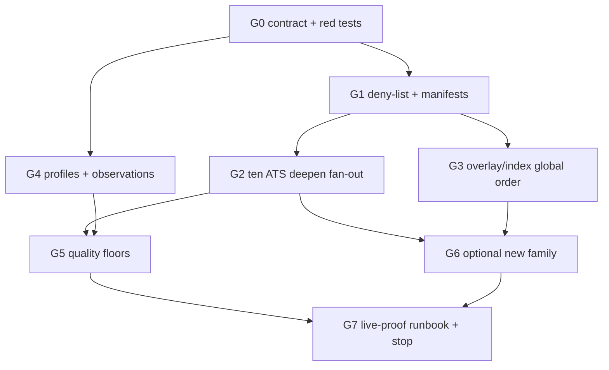

## Context

OpenOpps already has ten built-in ATS board adapters, packaged job-seeker overlay JSON with conserved per-employer outcomes, household public indexes, quarantined discovery, and four observability stacks (`SyncMetrics` on catalog `--metrics-json`, `PullTerminalObservability` on pull `--metrics-file`/`--raw`/`-v`, discovery JSON, web `/api/telemetry`). URL pull does not populate the catalog. Overlay locators are URL-match only.

Gaps that this successor must freeze before implementation:

- Capability manifests do not yet pin the ten provider ids to actual list/get hooks. Consider currently has no native get and no board-scan get. Ashby, Workable, and Teamtailor are board-scan-get only.
- Indeed and Glassdoor are accepted as out of scope but are absent from `source_scope.py`.
- Overlay work-order copy still carries US-weighted sequencing. Demand is global knowledge-work work-order only.
- `export.py` still `model_dump`s every field. Public JSON does not identify `profile` + `schemaVersion`.
- `_populate_enriched_fields` can make derived skills/seniority look provider-observed.
- Pointing conflict handling at `storage.py` `_unique_jobs_by_id` would collide with the 0.1.1 ledger closeout. Alembic head remains `0004`; `0005` is reserved elsewhere.
- T2 indexability already exists (`scripts/generate_docs_search_index.py` ↔ `web/lib/jobs-static-data.ts`). Quality floors should reuse that predicate, not invent a fifth metrics envelope or a shared `RunMetrics`.

Sibling campaigns own overlapping files: `unified-cli-job-pulls` (persistence/`url_pull_runs`), `cli-coverage-growth-observability` (four-stack honesty), `shared-board-listing-kernel` (identity bind), `production-hardening-static-data-v7` (v7 publication). This change joins them by depending on landed files — never by overlapping writers.

## Goals / Non-Goals

**Goals:**

- Deepen the ten built-in ATS families with honest manifests, complete listing, pagination/terminal evidence, and native or authoritative exact-get.
- Continue overlay core/expand/growth and household-index boards with global knowledge-work acquisition order.
- Admit new public ATS families only behind a demand-and-proof gate.
- Ship versioned `core`/`search`/`full`/`raw` projections plus companion observations with distinguishable origin.
- Stop on executable quality floors (T2 indexability, conflict/null/parse, capability gaps, diminishing yield), not padded source counts.
- Keep four observability stacks isolated. Keep discovery quarantined from `openopps sync`.

**Non-Goals:**

- Live Workers upload, production bootstrap, Kaggle mutation, source-policy 1780 grants, or any hosted publish from this change.
- Alembic `0005` or `0006`. Observation persistence is compute-at-projection until a storage-owned migration exists.
- A shared `RunMetrics` envelope, attaching `--metrics-json` to `jobs pull`, or mixing quality floors into `SyncMetrics` / `PullTerminalObservability`.
- Rewriting `storage.py` `_unique_jobs_by_id`.
- Stealing writers from `unified-cli-job-pulls`, `cli-coverage-growth-observability`, `shared-board-listing-kernel`, or `production-hardening-static-data-v7`.
- Wrapping `listing.py` unless G2 writers prove a shared evidence gap.
- Faking native get on Ashby, Workable, or Teamtailor. Presetting a first new ATS family (G6 evidence only; skip is success).
- Treating ignored `goals/*` files as tracked OpenSpec completion evidence.
- Editing application code, tests, overlay JSON, `AGENTS.md`, workflows, or Alembic in this OpenSpec leaf.

## Decisions

### Versioned profiles `core` / `search` / `full` / `raw`

Public job output uses named, versioned profiles rather than unrestricted model dumps. Each emitted JSON object SHALL identify `profile` and `schemaVersion`.

| Profile | Field intent |
| --- | --- |
| `core` | Identity, title, company, status, canonical URLs, dates |
| `search` | Governed cross-provider filter/rank fields consumed by web artifacts |
| `full` | Normalized record plus provenance (default CLI export) |
| `raw` | Listing/detail evidence where publication is permitted |

Prefer a new `src/openopps/job_profiles.py` projection helper. Wire `export.py` and `pull_output.py` through it. Thin `--profile` on `cli.py` only after export tests exist. Default CLI export/pull profile is `full`. Web search artifacts use `search`. No-DB JSONL uses the same profiles as DB-backed export.

A normalized field enters a public projection only through the field-promotion gate (documented semantics, distinguishable origin, source evidence, deterministic parser, explicit listing/detail conflicts, measured quality, Python/TypeScript agreement where both consume it, tested export/hash/history, demonstrated downstream utility). Provider-native fields stay in a namespaced extension until that gate passes.

### Companion observations; compute-at-projection

Rich observation history (source path, listing vs detail, method/version, conflict state, evidence linkage) lives in companion records, not as silent conflation on the Job row.

Origin is a closed enum: `provider_observed` | `openopps_derived` | `editorial`. Deterministic provider-observed values do not require confidence scores. Public projections carry compact origin tags. Derived skills/seniority MUST NOT look observed; split `_populate_enriched_fields` so those paths cannot be tagged `provider_observed`.

New module: `src/openopps/observations.py`. Compute at projection time. This change SHALL NOT add Alembic `0005` or `0006`. If `models.py` / `storage.py` / `alembic/**` are owned by the 0.1.1 closeout, skip those files. Do not rewrite `_unique_jobs_by_id`. Identity-conflict handling belongs in observations until a later storage campaign owns a linear migration.

### Field-promotion gate vs ATS family admission gate

These gates are distinct:

| Gate | Question | Evidence |
| --- | --- | --- |
| ATS family admission | May OpenOpps register a new jobs-capable provider id? | Public, unauthenticated; unlocks sought-after employers; listing + exact-get proof; capability manifest; deterministic fixtures |
| Field promotion | May a normalized field enter `core`/`search`/`full`? | Documented semantics, origin, evidence, parser, conflicts, quality, TS/Python parity, utility |

Provider-native fields remain namespaced until promotion. One-off HTML, login-walled, and anti-bot career pages record `no_public_ats` and do not get generic scrapers. Employer-specific adapters require the multi-signal custom-site gate (demand, inventory, breadth, no reusable platform path, tests, provenance, named owner).

G6 researches SmartRecruiters/Recruitee/iCIMS/Jobvite/JazzHR only as candidates. Implement at most families that pass admission. Otherwise an explicit skip test: one-off HTML does not register a provider. First new family is none preset.

### Honest ten-ATS capability manifests

Provider ids and current get honesty (do not overclaim at G0; G2 closes Consider):

| Provider id | List | Native get | Board-scan get |
| --- | --- | --- | --- |
| `greenhouse`, `lever` | documented | yes | — |
| `workday`, `rippling`, `bamboohr`, `wpjobmanager` | best-effort | yes | — |
| `ashbyhq` | documented | **no** | yes (+ unlisted enumerate gated) |
| `workable`, `teamtailor` | best-effort | **no** | yes |
| `consider_jobs` | best-effort | **no at G0** | **no at G0**; G2 exact-get from evidence |

Exact-get means a declared native public operation, or an authoritative complete board scan with exactly one match. Ashby/Workable/Teamtailor SHALL NOT fake native get. Greenhouse keeps advertised-count / duplicate-id fail-closed.

Indeed (`indeed.com`) and Glassdoor (`glassdoor.com`) are unsupported like LinkedIn and Wellfound. Wellfound, AngelList, WorkAtAStartup stay out. No CB-unicorn rank feed.

### Overlay successor: conserved outcomes, URL-match locators, global order

Keep overlay core/B-tier names (`core`, `expand`, `growth`) and the per-employer outcome enum: `fetchable_packaged`, `no_public_ats`, `duplicate`, `policy_blocked`. Exactly one outcome per employer/overlay id.

Locators attach jobs-capable routes only through `detect_url_matches`. A company domain, ticker, or overlay name never invents an ATS token. Packaged overlay gain SHALL NOT count url-pull or scout.

Acquisition order is globally sought-after knowledge-work employers and boards (AI, software, data, product, security, finance, biotech, and other professional roles). Demand is work-order only: not an inclusion filter, not US-HQ-only, and not a Jobs/Explorer ranking view. Posting volume is a tie-breaker. Drop US-weighted sequencing from overlay work-order copy and helpers.

Household seeds remain `fortune500`, `sp500`, `nasdaq100`, `sec-company-tickers`, and `yc`. Close missing routes in `household_routes.py` without inventing tokens.

### Isolated quality floors

New `src/openopps/coverage_quality.py`. Isolated from the four observability stacks. Not `--metrics-json`, not `--metrics-file`, not discovery JSON, not web telemetry, not a shared `RunMetrics`.

Floors:

- T2 search indexability (reuse `_is_indexable_job_detail` / `isIndexableJobDetail`, do not invent a fifth envelope)
- listing/detail conflict rate
- null/parse success per provider/field
- provider/field capability gaps
- diminishing-yield stop: prioritized demand tiers met and another research wave yields too few qualified additions

Optional CLI diagnostic under `admin`/`providers` only after help tests land on `W-CLI` after G4. That diagnostic is not `--metrics-json`.

`pull_coverage.py` / `pull_service.py` still MUST NOT import `openopps.discovery`.

### Exclusive lanes

One writer per lane. Same-lane tasks are serial (`W-OS`, `W-CLI`, `W-KERNEL`). Fan out a whole group when lanes are disjoint. This OpenSpec leaf owns only `W-OS`.

| Lane | Owned paths |
| --- | --- |
| `W-OS` | `openspec/changes/expand-end-to-end-opportunity-coverage/**` |
| `W-POLICY` | `src/openopps/source_scope.py`, `tests/unit/openopps/test_source_scope.py` |
| `W-OUTCOMES` | `overlay_outcomes.py`, `tests/unit/openopps/test_job_seeker_overlay_outcomes.py` |
| `W-CAP` | `tests/unit/openopps/test_provider_capability_manifests.py` |
| `W-ATS-GH` | `providers/boards/greenhouse.py` |
| `W-ATS-LEVER` | `providers/boards/lever.py` |
| `W-ATS-ASHBY` | `providers/boards/ashby.py` |
| `W-ATS-WORKABLE` | `providers/boards/workable.py` |
| `W-ATS-WORKDAY` | `providers/boards/workday.py` |
| `W-ATS-RIPPLING` | `providers/boards/rippling.py` |
| `W-ATS-TT` | `providers/boards/teamtailor.py` |
| `W-ATS-BAMBOO` | `providers/boards/bamboohr.py` |
| `W-ATS-CONSIDER` | `providers/boards/consider.py` |
| `W-ATS-WPJM` | `providers/boards/wpjobmanager.py` |
| `W-KERNEL` | `listing.py`, `url_targets.py` — optional after proven shared gap |
| `W-OVERLAY` | overlay source module, overlay targets, packaged overlay JSON, overlay unit tests |
| `W-INDEX` | `public_indexes.py`, `rankings.py`, `household_routes.py` |
| `W-REPORT` | `overlay_report.py` |
| `W-PROFILES` | `job_profiles.py`, `tests/unit/openopps/test_job_profiles.py` |
| `W-EXPORT` | `export.py`, `tests/unit/openopps/test_export.py` |
| `W-PULL-OUT` | `pull_output.py` |
| `W-OBS` | `observations.py`, `tests/unit/openopps/test_observations.py` |
| `W-QUALITY` | `coverage_quality.py`, `tests/unit/openopps/test_coverage_quality.py` |
| `W-SEARCH` | `scripts/generate_docs_search_index.py` and T2 vector tests |
| `W-WEB-TS` | `web/lib/jobs-static-data.ts` |
| `W-CLI` | thin `cli.py` after leaf modules exist, CLI help/integration tests |
| `W-DISCOVERY` | `src/openopps/discovery/**`, discovery unit tests (isolation only) |
| `W-DOCS` | nested `AGENTS.md`, `web/content/docs/**` after public CLI/help changes |
| `W-GOAL` | `goals/expand-end-to-end-opportunity-coverage/**` |
| `W-REG` | `providers/boards/__init__.py`, `providers/registry.py`, registry tests |
| `LIVE-WORKERS` / `LIVE-KAGGLE` / `W-ALEMBIC` / `W-STORAGE` | **empty** |

Do not start two writers on `cli.py`. G2 (ATS adapters) MAY run in parallel with G4 (profiles/observations) because the files are disjoint. G4 MUST NOT wait for G2.

### Optional listing kernel

Touch `listing.py` only via T040 after G2 writers prove a shared evidence gap. Catalog `fetch_jobs` and URL-list `pull_list` already share per-adapter membership plus `bind_listing_jobs`. Do not wrap ingest in `pull_list`. Teamtailor MUST NOT wrap `fetch_jobs` in the kernel.

### Discovery isolation and live-proof boundary

Scout, verify-scout, `launch_isolated_scout`, and preview-promotion never share a run with `openopps sync`, never take `--apply`, and never mutate operational SQLite, Git, Kaggle, or Cloudflare. Untrusted scout output is accepted only through `launch_isolated_scout`.

CI and packaged acceptance stay deterministic and offline. Bounded, rate-limited, unauthenticated, read-only live pulls may run **outside CI** for candidate validation. Live proof does not authorize publication, credentials, scout apply, catalog mutation, Workers, Kaggle, or Alembic `0005` live authority. Gitignored maintainer runbook only. Grep workflows so CI did not gain live ATS jobs.

## Migration and rollback

This OpenSpec leaf is additive documentation. Implementation waves add new modules (`job_profiles.py`, `observations.py`, `coverage_quality.py`), deny-list entries, capability tests, and thin CLI flags. Rolling back Python later removes `--profile`, quality diagnostics, and projection helpers without changing persisted catalog rows or requiring a down-migration, because this change does not land Alembic revisions.

v1 unrestricted `model_dump` export is replaced by named profiles; `full` is the CLI default so existing local dumps stay the superset. Web artifacts switch to `search` only through the existing T2 generation path.

## Parallel task graph and ownership



```text
Wave 0 OpenSpec (this leaf: T001–T004 on W-OS) + parallel red tests (T005–T010)
  |
  +--> G1 deny-list + honest manifests
  |      |
  |      +--> G2 ten W-ATS-* writers (Consider exact-get required)
  |      |      +--> optional T040 listing.py after proven shared gap
  |      +--> G3 overlay/index global order
  |
  +--> G4 profiles + observations (parallel with G2; disjoint files)
         |
         +--> G5 coverage_quality.py + optional CLI diagnostic
                |
                +--> G6 admit or skip
                +--> G7 gitignored live-proof runbook; no live publish
```

This leaf owns `openspec/changes/expand-end-to-end-opportunity-coverage/**` and MUST NOT touch application code.

## Risks / Trade-offs

- **Large dirty worktree.** Hunk-level merges only; never `git add -A`. Accepted: preserve unrelated files.
- **`cli.py` / `listing.py` / `models.py` contention.** Yield the file; do not dual-write with sibling campaigns. Accepted: thin CLI after helpers exist.
- **Profile fields can change hashes, search artifacts, and TypeScript types.** The field-promotion gate and T2 lockstep exist to prevent drive-by schema growth.
- **Bounded live proof looks like publication.** Keep the G7 runbook fail-closed: read-only pull, no `--save` until persistence is owned elsewhere, no scout `--apply`, no Wrangler/Kaggle.
- **G6 can become a distraction.** The skip path (one-off HTML does not register) is a first-class success.
- **Consider exact-get vs honesty.** Advertising native get at G0 would overclaim. Accepted: G0 red test says no get; G2 lands exact-get from evidence.
