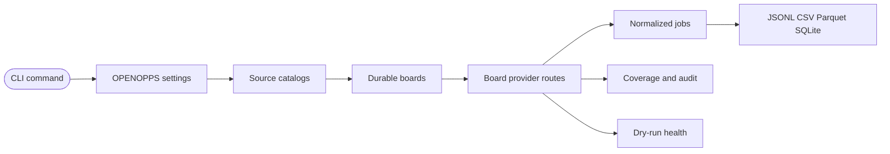

OpenOpps exposes the `openopps` console script from `openopps.cli:app`. Treat the CLI as a local data pipeline: source catalogs become durable board records, board records become executable provider routes, provider routes become normalized jobs, and exports preserve the resulting ledger for audit or analysis.



## Invocation

Run through the repository environment during development:

```bash
uv sync
just --list
uv run openopps --help
uv run openopps status
```

Install the current checkout as an editable uv tool when you want to call `openopps` directly:

```bash
uv tool install -e .
openopps --help
openopps status
```

The editable tool uses the same runtime settings as `uv run`, including `OPENOPPS_DB_URL`, plugin allow lists, cache settings, and current working-directory-relative SQLite paths.

Typer already ships shell completion. Enable it with the built-in flags; this project does not add a custom completer:

```bash
uv run openopps --install-completion
uv run openopps --show-completion
```

## Workflow

`status` and `doctor` sit on the Everyday workflow panel. `doctor` prints the same JSON-shaped status payload as `status`, then a first-time checklist: set `OPENOPPS_DB_URL`, run `openopps admin db init` (idempotent), then either `openopps https://…` or `openopps sync a16z --metrics-json`. Successful `doctor` does not claim the schema is missing. `nextAction` never names `discovery scout`.

The normal sequence is:

1. Pull an HTTPS careers URL (`openopps https://…`) or run `openopps sync a16z --metrics-json`.
2. Use `sources sync`, `boards sync`, or `jobs sync` when rerunning one stage.
3. Inspect `providers coverage`, `providers audit`, or `admin providers registry` when route metadata is incomplete.
4. Use `jobs list`, `boards export`, or `jobs export` for analysis.

Use `status` or `doctor` between steps to see counts, route readiness, cache state, plugin load state, and the next recommended action.

`openopps discovery` is not a step in this sequence. Scout, verify-scout, and preview-promotion are advanced admin commands and are not same-run with ingest (`openopps sync`, `sources sync`, `boards sync`, or `jobs sync`).

## Safety Classes

| Class | Examples | What changes |
| ----- | -------- | ------------ |
| Read-only local inspection | `status`, `doctor`, `sources list`, `providers coverage`, `plugins list`, `cache status` | Reads local SQLite/catalog state only. |
| Writes local SQLite state | `examples seed`, `sources sync`, `boards sync`, `jobs sync`, `admin boards add`, `admin db init` | Creates or updates records under `OPENOPPS_DB_URL` and cache settings. |
| Live upstream diagnostics | `admin sources test`, `providers health`, `admin providers probe-routes` | Calls public source or provider endpoints; dry-run unless the command documents `--apply`. |
| Quarantined discovery | `discovery scout`, `discovery verify-scout`, `discovery preview-promotion` (also `admin sources` aliases) | Scout writes only an explicit quarantine directory. Verify is offline and read-only. Preview is a read-only on-disk B699 identity-closure dry-run. No `--apply`. Not same-run with `sync`. |
| Destructive local maintenance | `admin cache purge` | Deletes local cache records; scope with `--namespace` when possible. |

`--apply` is intentionally absent from most everyday commands. When it appears on diagnostics such as route probing or health checks, treat it as the boundary between inspection and persistence. Quarantined discovery commands never expose `--apply`.

## Command Groups

| Surface | Commands | Purpose |
| ------- | -------- | ------- |
| `sync` | top-level | Run source discovery, board route resolution, and job sync in order. |
| `status` | top-level (Everyday) | Report database, cache, plugin, route readiness, and next action. |
| `doctor` | top-level (Everyday) | Same status payload plus the URL-first setup checklist. Not a discovery wizard. |
| `sources` | `list`, `show`, `sync` | Inspect aggregate discovery catalogs and import board records. |
| `boards` | `sync`, `list`, `show`, `export` | Resolve, inspect, and export firm or company hiring board records. |
| `jobs` | `sync`, `list`, `show`, `history`, `export` | Fetch, inspect, version, and export normalized public postings. |
| `providers` | `health`, `coverage`, `audit` | Inspect live health, persisted coverage gaps, and adoption evidence. |
| `cache` | `status` | Inspect the SQLite request cache. |
| `plugins` | `list` | Inspect installed plugin entry points, capabilities, and failures. |
| `examples` | `seed` | Seed deterministic synthetic demo data. |
| `discovery` | `scout`, `verify-scout`, `preview-promotion` | Quarantined scout into an explicit output directory, offline bundle verify, and digest-bound promotion preview. Advanced admin; does not promote, sync, or activate candidates. |
| `admin` | `sources`, `boards`, `providers`, `cache`, `db` | Advanced registration, quarantined scout aliases, route diagnostics, cache purge, and DB maintenance. |

## Admin inventory

Use these commands for registration, portable backups, and route metadata repair. They are grouped under `openopps admin` and are separate from everyday `sync` workflows. `admin sources add`, `test`, and `yield` stay the custom-catalog, adapter-sample, and persisted-yield commands. Quarantined scout, verify, and promotion preview are aliased under `admin sources` so OpenSpec command strings stay available; the primary group is `openopps discovery`.

| Group | Command | Purpose |
| ----- | ------- | ------- |
| `admin db` | `init` | Create or upgrade the local SQLite schema at `OPENOPPS_DB_URL`. |
| `admin db` | `status` | JSON counts and path for the configured database. |
| `admin db` | `export --output <path>` | Copy the local `sqlite:///` database to a portable SQLite file (requires a local SQLite URL). |
| `admin db` | `vacuum` | Compact the configured SQLite database file. |
| `admin boards` | `add-provider` | Attach explicit provider route metadata (token, hosted URL, or site fields) when probing did not resolve a board. |
| `admin boards` | `detect-provider` | Detect provider metadata from one board URL; add `--apply` to persist. |
| `admin providers` | `detect <url>` | Detect which packaged provider adapter matches a public board URL without a board scope. |
| `admin providers` | `probe-routes` | Try route candidates and report boards that can fetch jobs; `--apply` persists matches. |
| `admin providers` | `registry` | Inspect the durable `board_providers` route registry before job sync. |
| `admin sources` | `scout --output <dir>` | Same callback as `discovery scout`. Requires an explicit quarantine directory. No `--apply`. |
| `admin sources` | `verify-scout <manifest>` | Same callback as `discovery verify-scout`. Offline verify of `manifest.json` or the bundle directory. |
| `admin sources` | `preview-promotion [manifest]` | Same callback as `discovery preview-promotion`. Read-only on-disk B699 identity-closure dry-run. No `--apply`. |

```bash
uv run openopps admin db export --output /tmp/openopps-backup.sqlite
uv run openopps admin db vacuum
uv run openopps admin boards add-provider a16z:example --provider ashbyhq --url 'https://jobs.ashbyhq.com/example'
uv run openopps admin providers detect 'https://jobs.ashbyhq.com/example'
```

## Quarantined source discovery

`openopps discovery` is the advanced-admin group for quarantined source discovery. Root help places it on the Advanced admin panel so everyday `sync`, `sources`, `boards`, and `jobs` stay primary. It does not promote, sync, or activate candidates, and it is not same-run with ingest (`openopps sync`) or with `sources sync` / `boards sync` / `jobs sync`.

The same callbacks are aliased as `openopps admin sources scout`, `verify-scout`, and `preview-promotion`. None of these commands accept `--apply`.

Scout requires `--output <directory>` (`-o` / `-O`) and writes only there. `--json` (`-j` / `-J`) emits machine-readable JSON. There is no `--apply` option; passing `--apply` is rejected. Default unscoped `openopps sync` remains the snapshot writer and keeps using the last reviewed approved catalog. Ledger/L.2 snapshot tables are not landed. Scout output is not a snapshot and is not live publication evidence.

```bash
uv run openopps discovery scout --output /absolute/quarantine-root --json
uv run openopps discovery verify-scout /absolute/quarantine-root --json
uv run openopps discovery preview-promotion --json
uv run openopps admin sources scout --output /absolute/quarantine-root --json
uv run openopps admin sources verify-scout /absolute/quarantine-root --json
uv run openopps admin sources preview-promotion --json
```

| Command | Options and arguments | What it does | What it does not do |
| ------- | --------------------- | ------------ | ------------------- |
| `discovery scout` | `--output <dir>` (required; `-o` / `-O`), `--json` (`-j` / `-J`) | Writes one evaluation quarantine bundle under the explicit directory. Selector-bound scout pins the private approved-ingestion envelope and does not accept the v7 public `SourceSelector`. | Mutate operational SQLite, catalogs, Git, Kaggle, or Cloudflare; accept `--apply`; run ingest or promotion in the same invocation. |
| `discovery verify-scout` | `<manifest>` (required path), `--json` (`-j` / `-J`) | Offline-verifies `manifest.json` or the bundle directory that contains it. Re-validates the private approved-ingestion envelope. | Rewrite or repair the bundle; activate candidates; accept `--apply`; run ingest in the same invocation. |
| `discovery preview-promotion` | optional `[manifest]`, `--json` (`-j` / `-J`) | Dry-run a digest-bound repository promotion preview without applying. Omit the manifest to preview the on-disk B699 identity-closure envelope, decision, receipt, and ledger. Pass a quarantine manifest to offline-verify that bundle first, then preview an empty candidate selection bound to the verified digest. | Reserve, apply, acquire the promotion lock, or grant authority. Does not mutate Git remotes, operational SQLite, Kaggle, Cloudflare, or the catalog. There is no `--apply` option. |

The current CLI scout publishes a bundle from an empty occurrence set against read-only v7 policy digests. Channel enumerators (`official`, `public_code`, `search`, `targeted_ats`) are replay-library surfaces, not a live crawl from this command. Public CI keeps `OPENOPPS_DISCOVERY_NETWORK=disabled`. Isolated scout limits live under `OPENOPPS_DISCOVERY_*` and do not change `openopps sync`; see [Configuration](/docs/configuration#isolated-discovery-scout).

Scout JSON includes `activated=false` and `promoted=false`. Preview JSON includes `applied=false` and `grantsAuthority=false`. Omitting the preview manifest sets `identityClosure=true` for the on-disk B699 identity-closure path. Treat those fields as evidence, not as an apply path.

## Job inspection

`jobs show` prints one normalized job record as JSON, including current lifecycle fields and enriched metadata. Use the job `id` from `jobs list --json`.

`jobs history` lists normalized **content versions** for the same posting id (`job_versions`), not raw provider payload snapshots. Payload-only drift can update `job_payload_snapshots` and sync observations without creating a new content version. Add `--json` for automation; the default table view shows version, content hash prefix, first/last seen timestamps, and title per version.

```bash
uv run openopps jobs show '<job-id>'
uv run openopps jobs history '<job-id>' --json
```

## Option Conventions

Examples use long flags for readability. The CLI also exposes script-friendly short aliases for high-traffic options:

| Long flag | Aliases | Used by |
| --------- | ------- | ------- |
| `--source` | `-s`, `-S` | Source, board, job, provider, and audit scopes. |
| `--board` | `-b`, `-B` | Job sync/list/export and route diagnostics. |
| `--provider` | `-p`, `-P` | Board, job, provider, and route scopes. |
| `--limit` | `-n`, `-N` | List and diagnostic result limits. |
| `--json` | `-j`, `-J` | Machine-readable command output, including discovery scout, verify, and preview. |
| `--output` | `-o`, `-O` | Export or no-DB output paths, and the required scout quarantine directory. |
| `--format` | `-f`, `-F` | Export format selection. |
| `--metrics-json` | `-m`, `-M` | Sync metrics output. |
| `--refresh-cache` | `-r`, `-R` | Fresh upstream reads for cacheable request paths. |
| `--verbose` | `-v`, `-V` | Detailed sync warnings instead of compact progress. |

`--provider any` and `--provider all` both remove the provider filter. They are useful in reusable scripts that always pass a provider argument, but they do not mean “only providers named any/all.”

## Common Commands

```bash
uv run openopps status --json
uv run openopps doctor --json
uv run openopps sync a16z --metrics-json --refresh-cache
uv run openopps sources sync a16z --metrics-json
uv run openopps boards sync --source a16z --provider any --metrics-json
uv run openopps jobs sync --provider ashbyhq --metrics-json --refresh-cache
uv run openopps providers coverage --source a16z --provider any --json
uv run openopps admin providers probe-routes --source a16z --provider any --limit 25 --json
```

Provider hints from source catalogs may lack the token or URL needed for job fetching. `admin providers probe-routes` tries candidate tokens from upstream slugs, remote ids, names, domains, and websites, then reports both matched routes and unknown boards. It is read-only unless `--apply` is passed.

## Board Filters

`boards list` and `boards export` share these filters:

| Flag | Semantics |
| ---- | --------- |
| `--source` | Exact source key, such as `a16z` or `yc`. |
| `--provider` | Exact detected board-provider route id. `any` and `all` remove the filter. |
| `--market` | Case-insensitive substring match against board market tags. |
| `--location` | Case-insensitive substring match against normalized board locations. |
| `--domain` | Case-insensitive substring match against normalized board domains. |
| `--has-jobs` | Keep boards with a source job hint, provider job hint, or synced job. |
| `--min-staff` | Keep boards with `staff_count` greater than or equal to the value. |
| `--max-staff` | Keep boards with `staff_count` less than or equal to the value. |
| `--limit` | Apply a final limit after filters. |
| `--json` | JSON output mode for `boards list`. |

Use the exact persisted board key shown by `boards list`; provider requests are deduped before probing or job sync when overlapping source coverage points at the same provider route.

## Job Filters

`jobs list` and `jobs export` default to current active jobs with `--status open` across all boards and providers. Use `--status closed` or `--status all` for lifecycle audits.

| Flag | Semantics |
| ---- | --------- |
| `--source` | Exact source key via the job's board record. |
| `--board` | Exact persisted board key from `boards list`. |
| `--provider` | Exact job provider id. `any` and `all` remove the filter. |
| `--location` | Case-insensitive substring match against normalized job locations. |
| `--department` | Case-insensitive substring match against normalized department. |
| `--team` | Case-insensitive substring match against normalized team. |
| `--workplace-type` | Case-insensitive substring match against normalized workplace type. |
| `--remote` | Case-insensitive exact match against normalized remote level: `Full`, `Hybrid`, or `None`. |
| `--employment-type`, `--type` | Case-insensitive substring match against normalized employment type. |
| `--salary-min` | Keep jobs whose normalized salary range overlaps this lower bound. |
| `--salary-max` | Keep jobs whose normalized salary range overlaps this upper bound. |
| `--skill` | Case-insensitive substring match against normalized skill name, level, or keywords. |
| `--query` | Case-insensitive substring match across normalized title, company, and plain-text description. |
| `--posted-after` | Inclusive `YYYY-MM-DD` lower bound for normalized `posted_at` dates. |
| `--posted-before` | Inclusive `YYYY-MM-DD` upper bound for normalized `posted_at` dates. |
| `--status` | Lifecycle filter: `open`, `closed`, or `all`. Defaults to `open`. |
| `--limit` | Apply a final limit after filters. |
| `--json` | JSON output mode for `jobs list`. |

Date filters intentionally only match jobs whose normalized `posted_at` starts with `YYYY-MM-DD`, such as ISO timestamps. Relative provider text such as `Posted Yesterday` is not used for public filtering semantics.

## Exports

```bash
uv run openopps boards export --provider ashbyhq --has-jobs --format csv --output /tmp/openopps-boards.csv
uv run openopps jobs export --source a16z --type full --format parquet --output /tmp/openopps-jobs.parquet
```

`boards export` and `jobs export` support:

| Format | Use case |
| ------ | -------- |
| `jsonl` | Streaming and audit-friendly line-delimited records. |
| `csv` | Spreadsheet inspection and lightweight exchange. |
| `parquet` | Analytics workflows with Polars, DuckDB, or warehouse ingestion. |
| `sqlite` | Local relational handoff, reproducible filtered extracts, or direct SQLite clients. |

JSONL exports stream line-delimited records and empty JSONL/CSV exports produce empty files. Empty Parquet exports produce a readable empty Parquet table. CSV exports neutralize spreadsheet formula-leading strings by prefixing a single quote. SQLite exports should keep the same flattened field contract as CSV/Parquet and store nested values as stable JSON strings.

For schema, SQLite, and search-index details, see [Data Model](/docs/data-model).

## Agent Plugins

Favorite agents can drive OpenOpps through two [Agent Plugins 1.0.0](/docs/agent-plugins) packages in the checkout (`agent-plugins/openopps/` for installed-CLI users and `agent-plugins/openopps.dev/` for contributors). Clients start bundled `./bin/mcp` (`help` and `run` only). There is no public `openopps mcp` command. User `run` refuses `discovery` and `admin sources scout|verify-scout|preview-promotion`. Contributor `run` allows only those three discovery commands (JSON). Python `openopps.plugins` remains a different system; see `examples/plugins/`.

## Troubleshooting Map

| Symptom | Command to run first |
| ------- | -------------------- |
| Local state looks empty | `uv run openopps status --json` |
| A source returns no boards | `uv run openopps admin sources test <source> --page-size 5 --refresh-cache` |
| A board has provider hints but no jobs | `uv run openopps admin providers registry --include-missing --json` |
| Route metadata is missing | `uv run openopps admin providers probe-routes --source <source> --provider any --limit 25 --json` |
| Cached data looks stale | Rerun the command with `--refresh-cache` or purge a specific namespace. |
| Need a quarantined candidate bundle | `uv run openopps discovery scout --output <dir> --json` then `discovery verify-scout` (or the `admin sources` aliases) |
| Need a promotion dry-run | `uv run openopps discovery preview-promotion --json` (on-disk B699 identity closure; no `--apply`) |
| Export output is empty | Check `status`, then rerun the matching `list` command with the same filters and `--json`. |
